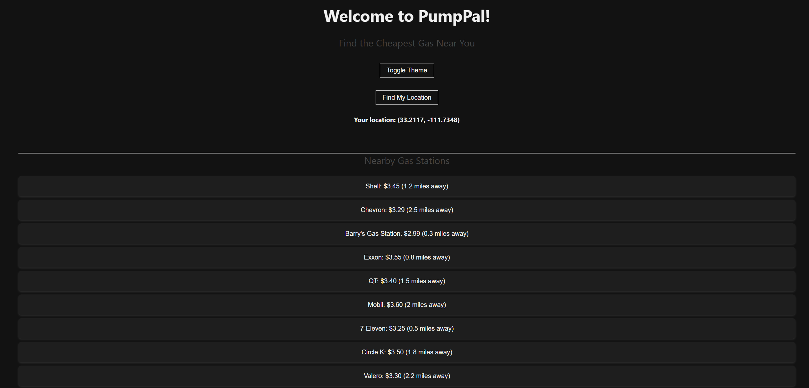
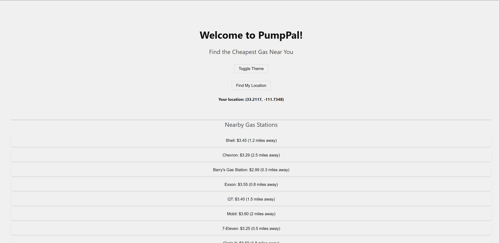

# PumpPal - Find the Cheapest Gas Near You

PumpPal is a lightweight, browser-based web app that detects your location and displays simulated nearby gas station prices. Built for portfolio purposes to demonstrate geolocation, DOM rendering, and GitHub Pages deployment.

---

## Features
- Geoloccation using the browser's API
- Dynamic rendering of gas station listing (mocked)
- Error handling (denied permissions, unavailable location, etc.)
- Clean, responsive UI with card-style layout
- Detects user’s current location
- Deployed with GitHub Pages
- Displays coordinates
- API-ready codebase for fuel pricing integration

---

## Preview

## Technologies Used 
- HTML5, CSS3, JavaScript
- Git & GitHub
- GitHub Pages for deployment
- Visual Studio Code

---

## Lessons Learned
- Using geolocation in JavaScript
- DOM manipulation best practices
- Deploying static projects with GitHub Pages
- Structuring code for modularity and clarity

---

## Project Structure
- `index.html` – Web UI
- `style.css` – Styling
- `app.js` – Location + logic
- `.gitignore` – Clean version control

---

## How to Run
1. Clone the repo
2. Open `index.html` in a browser
3. Click the button to see your location

---

## Todo
- Integrate gas pricing API
- Sort stations by distance & price
- Deploy to GitHub Pages or Vercel

---

## Future Plans
- Integrate real-time gas prices using public APIs
- Add sort/filter controls (by price, distance)
- Responsive mobile-first redesign
- Save user preferences (localStorage)

> Built by Barry Ngon (https://github.com/b1ngon)
